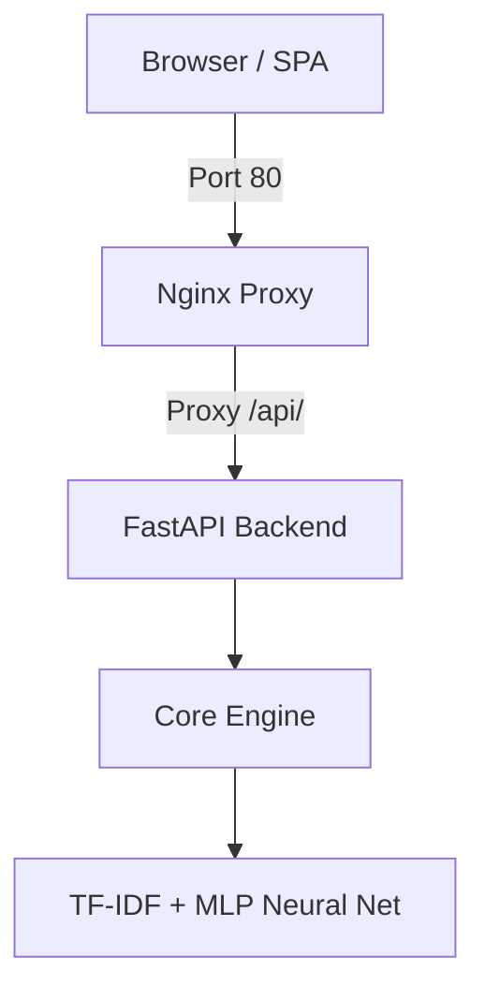

# Study Prep Guide: Agent Smith

Welcome! This guide is a step-by-step tutorial designed to help a complete beginner understand, build, and extend **Agent Smith** from scratch. You will learn about web servers, APIs, and classical Machine Learning (NLP) pipelines.

---

## 🗺️ What We Are Building
Agent Smith is a **local-first AI orchestration platform**. It allows you to:
1. **Create Agents**: Define intents (what a user says) and responses (what the agent says).
2. **Train Agents**: Fit a neural classifier entirely locally.
3. **Chat**: Converse with your agents with session-based memory.
4. **Document Context**: Ground agent replies using text uploaded from documents (RAG).

Here is the system architecture:


---

## 📚 Core Prerequisites

To fully grasp this project, you need a basic understanding of:
1. **Python**: Variables, classes, functions, and list/dict manipulation.
2. **FastAPI**: A modern, fast (high-performance) web framework for building APIs with Python.
3. **Machine Learning Basics**: 
   - **TF-IDF**: A way to convert text sentences into numbers based on word frequencies.
   - **Multi-Layer Perceptron (MLP)**: A simple neural network that learns to classify numbers into categories (intents).

---

## 🛠️ Step-by-Step Implementation Guide

Let's build a mini-version of Agent Smith step-by-step!

### Step 1: Set Up the Environment
Create a new directory and virtual environment:
```bash
mkdir mini-agent-smith
cd mini-agent-smith
python -m venv venv
venv\Scripts\activate  # On Windows
pip install fastapi uvicorn scikit-learn numpy
```

### Step 2: The Intent Classifier (Machine Learning Pipeline)
Let's write a simple Python script `classifier.py` to train an NLP classifier on custom patterns:
```python
from sklearn.feature_extraction.text import TfidfVectorizer
from sklearn.neural_network import MLPClassifier
import numpy as np

# 1. Prepare Training Data
intents = [
    {"tag": "greeting", "patterns": ["hello", "hi", "hey there", "greetings"], "responses": ["Hello! How can I help you?"]},
    {"tag": "goodbye", "patterns": ["bye", "goodbye", "see you later", "exit"], "responses": ["Goodbye! Have a great day!"]},
]

corpus = []
tags = []
responses = {}

for intent in intents:
    responses[intent["tag"]] = intent["responses"]
    for pattern in intent["patterns"]:
        corpus.append(pattern)
        tags.append(intent["tag"])

# 2. Vectorize the Text using TF-IDF
vectorizer = TfidfVectorizer(lowercase=True)
X = vectorizer.fit_transform(corpus)

# 3. Train the Multi-Layer Perceptron (Neural Network)
model = MLPClassifier(hidden_layer_sizes=(16, 8), max_iter=1000, random_state=42)
model.fit(X, tags)

print("Model trained successfully!")

# 4. Predict User Utterance
test_input = ["hello there friend"]
test_vector = vectorizer.transform(test_input)
prediction = model.predict(test_vector)[0]
confidence = np.max(model.predict_proba(test_vector)[0])

print(f"Input: {test_input}")
print(f"Predicted intent: {prediction} (Confidence: {confidence:.2f})")
```

Run this file:
```bash
python classifier.py
```

---

### Step 3: Build the FastAPI Web API
Now, let's wrap our classifier into a FastAPI app! Create `app.py`:
```python
from fastapi import FastAPI, HTTPException
from pydantic import BaseModel
from sklearn.feature_extraction.text import TfidfVectorizer
from sklearn.neural_network import MLPClassifier
import numpy as np

app = FastAPI()

# In-memory storage for simplicity
vectorizer = TfidfVectorizer(lowercase=True)
model = MLPClassifier(hidden_layer_sizes=(16, 8), max_iter=1000, random_state=42)
responses = {
    "greeting": ["Hello! How can I help you?", "Hi there!"],
    "goodbye": ["Goodbye!", "See you later!"]
}

# Pre-train
corpus = ["hello", "hi", "hey there", "bye", "goodbye", "exit"]
tags = ["greeting", "greeting", "greeting", "goodbye", "goodbye", "goodbye"]
X = vectorizer.fit_transform(corpus)
model.fit(X, tags)

class ChatQuery(BaseModel):
    message: str

@app.post("/chat")
def chat(query: ChatQuery):
    X_test = vectorizer.transform([query.message])
    pred = model.predict(X_test)[0]
    conf = float(np.max(model.predict_proba(X_test)[0]))
    
    if conf < 0.3:
        return {"reply": "I'm not sure what you mean. (Low confidence)"}
    
    import random
    reply = random.choice(responses[pred])
    return {"reply": reply, "intent": pred, "confidence": conf}

if __name__ == "__main__":
    import uvicorn
    uvicorn.run(app, host="127.0.0.1", port=8000)
```

Run the server:
```bash
python app.py
```
Open your browser and navigate to `http://127.0.0.1:8000/docs` to test your API!

---

## 🔍 Key Deep Dive Topics

### 1. Nginx Reverse Proxy
Why do we use Nginx?
- **Single Port Access**: Without Nginx, the UI runs on port 80/3000 and the backend runs on port 8000. Nginx proxies requests to the backend using path routing: `/api/*` goes to the backend, everything else serves the static UI files.
- **Security & Load Balancing**: Nginx handles heavy traffic, logs requests efficiently, and adds an extra security layer.

### 2. Conversational Memory
To maintain context across multiple turns, we keep a rolling window of recent user messages. When the user asks a follow-up question (e.g. "What is it?"), we prepend the previous messages so the vectorizer has context:
```python
enriched_query = " ".join(recent_user_turns + [current_user_message])
```

---

## 🎯 Verification Tasks

1. **Modify Confidence**: Change the `CONFIDENCE_THRESHOLD` in `core_engine.py` and observe when the fallback response triggers.
2. **Add Intents**: Add a new intent dynamically using the frontend dashboard (e.g., "help", "status") and verify that the agent learns it immediately without rebooting the server.
3. **Local Testing**: Execute `INSTALL.bat` and then `Run_Project.bat` to see the complete application running locally.
