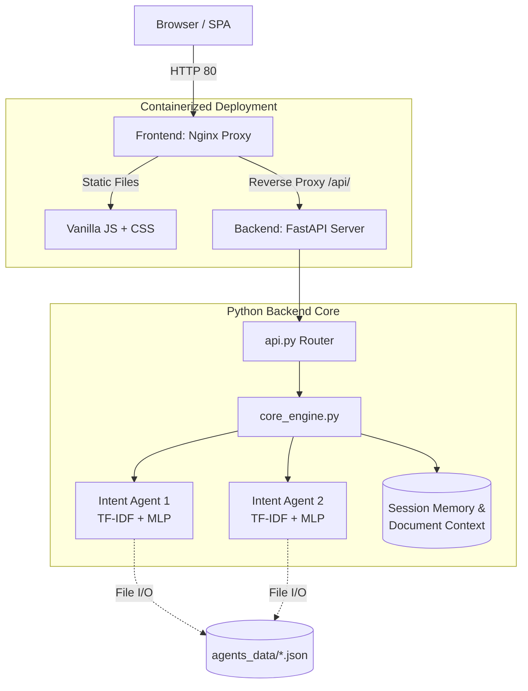

<h1 align="center">
  <br>
  
  <br>
  Agent Smith
  <br>
</h1>

<h4 align="center">A production-ready, local-first AI orchestration platform built with FastAPI, React-inspired UI, and scikit-learn.</h4>

<p align="center">
  
  
  
  
  
  
</p>

<p align="center">
  <a href="#-overview">Overview</a> •
  <a href="#-key-features">Features</a> •
  <a href="#-architecture">Architecture</a> •
  <a href="#-quick-start">Quick Start</a> •
  <a href="#-api-reference">API Reference</a>
</p>

---

## 🎯 Overview

**Agent Smith** is an enterprise-grade, intent-based AI orchestration platform designed to securely run multi-agent systems **100% locally**. It eliminates external API dependencies and cloud subscriptions, guaranteeing complete data privacy. 

Backed by a neural classification engine (TF-IDF Vectorization paired with a multi-layer perceptron neural network), Agent Smith enables users to dynamically deploy, train, and chat with highly specialized agents. The platform features an decoupled microservice architecture (Nginx Frontend + FastAPI Backend), making it highly scalable and ready for production containerized deployment.

---

## ✨ Key Features

| Feature | Description |
|---|---|
| 🤖 **Dynamic Agent Orchestration** | Spin up, train, and manage multiple customized AI agents simultaneously via the dashboard. |
| 🧠 **Neural Intent Engine** | Proprietary local ML pipeline (TF-IDF + MLP) ensures rapid, accurate intent matching with adjustable confidence limits. |
| 📊 **Microservice Architecture** | Production-ready separation of concerns: Nginx serves the UI and proxies requests to the Python FastAPI backend. |
| 📄 **Document Context Injection** | Real-time RAG (Retrieval-Augmented Generation) supporting PDF, DOCX, and TXT files to ground agent responses. |
| 🔄 **Hot-Reloading** | Train or delete agents on the fly—zero downtime or server restarts required. |
| 🛡️ **Enterprise Security** | Enforces path traversal prevention, strict MIME/file-size validation, and safe agent naming regex constraints. |
| 🐳 **Docker Native** | 100% containerized with `docker-compose`, featuring decoupled frontend and backend services for scalable deployment. |

---

## 🏗 Architecture

Agent Smith employs a professional microservice architecture, strictly separating the user interface from the machine learning engine.



---

## 🚀 Quick Start

### Option 1: One-Click Windows Launch (Local)
For local development and testing, Agent Smith includes automated `.bat` scripts.

1. **Clone the repository:**
   ```bash
   git clone https://github.com/Ares19v/Agent-Smith.git
   cd Agent-Smith
   ```
2. **Install Dependencies:**
   Double-click `INSTALL.bat`. This automatically provisions a Python virtual environment and installs all requirements securely.
3. **Run the Project:**
   Double-click `Run_Project.bat`. This boots the FastAPI server and automatically opens the dashboard in your default browser.

*(To clean up your environment and save space, simply run `UNINSTALL.bat`)*

### Option 2: Docker Compose (Production Recommended)
For production or OS-agnostic deployment, use the containerized microservices.

```bash
# Build the Nginx frontend and FastAPI backend containers
docker-compose up --build -d
```
The application will instantly be available at **`http://localhost`**.

---

## 📡 API Reference

Agent Smith includes self-documenting APIs via Swagger UI. Once running, navigate to `http://localhost:8000/docs` (or `/docs` if using Docker) to explore the interactive endpoints.

### Core Endpoints

| Method | Endpoint | Purpose |
|---|---|---|
| `GET` | `/api/agents` | Retrieve a list of all active neural agents. |
| `POST` | `/api/agents` | Provision and train a new agent dynamically. |
| `POST` | `/api/chat` | Route a chat query to a specific agent for inference. |
| `POST` | `/api/upload` | Upload context documents (PDF/DOCX) for live RAG injection. |
| `GET` | `/api/health` | Container liveness probe & system status. |

**Example Inference Request:**
```bash
curl -X POST http://localhost:8000/api/chat \
  -H "Content-Type: application/json" \
  -d '{"agent_name": "Coder", "message": "hello"}'
```
```json
{ "response": "System online. Ready to compile." }
```

---

## 📂 Project Structure

```text
Agent-Smith/
├── .github/workflows/       # CI/CD pipelines (Automated Build & Linting)
├── backend/                 # Python Machine Learning Core
│   ├── api.py               # REST route handlers & endpoint logic
│   ├── app.py               # FastAPI application factory
│   ├── core_engine.py       # ML Pipeline, Agent Lifecycle, Memory State
│   ├── Dockerfile           # Python 3.10 Slim backend container
│   ├── requirements.txt     # Python dependencies
│   └── agents_data/         # Persisted neural profiles (JSON)
├── frontend/                # User Interface Layer
│   ├── Dockerfile           # Nginx Alpine frontend container
│   ├── nginx.conf           # Reverse proxy configuration
│   ├── index.html           # SPA Shell
│   └── static/              # CSS/JS Assets
├── docker-compose.yml       # Microservice orchestration
├── INSTALL.bat              # Local automated installer
├── Run_Project.bat          # Local automated launcher
└── UNINSTALL.bat            # Safe local cleanup script
```

---

## ⚙️ Advanced Configuration (LLM Fallbacks)

Agent Smith prioritizes strict offline capability via the local MLP intent engine. However, it provides programmatic hooks to fallback to LLMs (OpenAI, Groq, Ollama) if the classification confidence drops below `CONFIDENCE_THRESHOLD`.

To enable this:
1. Rename `.env.example` to `.env` and provide your API keys.
2. Uncomment the respective integration stubs inside `backend/core_engine.py`.

---

## 📜 License

Distributed under the **MIT License**. See `LICENSE` for more information.

---

<p align="center">
  <b>Built for Performance, Privacy, and Scalability.</b><br>
  <i>Designed and Engineered by Devansh Tyagi</i>
</p>