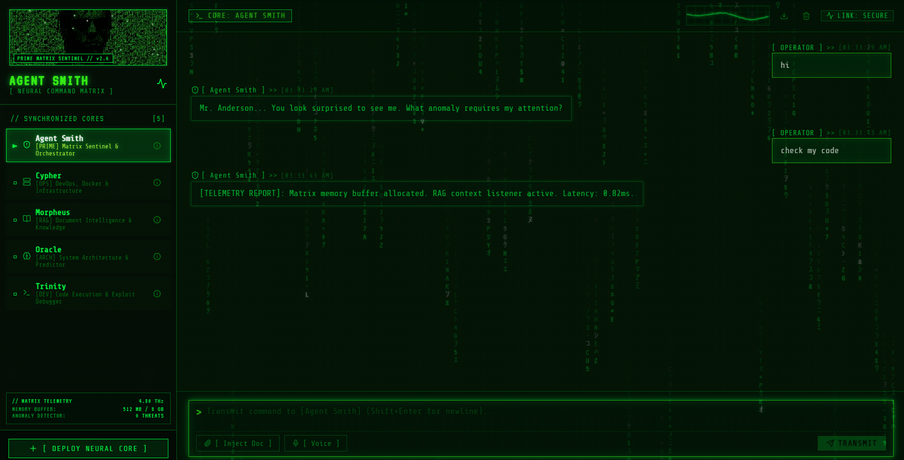
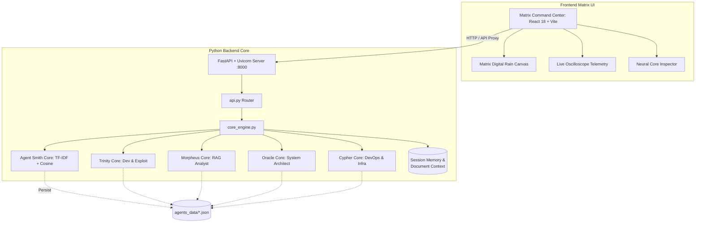

<h1 align="center">
  <br>
  
  <br>
  AGENT SMITH
  <br>
</h1>

<h4 align="center">A high-performance, local-first AI orchestration platform & Matrix Command Center built with React 18, Vite, FastAPI, Uvicorn, and scikit-learn.</h4>

<p align="center">
  
  
  
  
  
  
  
</p>

<p align="center">
  <a href="#-overview">Overview</a> •
  <a href="#-matrix-command-center">Command Center</a> •
  <a href="#-neural-cores">Neural Cores</a> •
  <a href="#-key-features">Features</a> •
  <a href="#-architecture">Architecture</a> •
  <a href="#-quick-start">Quick Start</a> •
  <a href="#-api-reference">API Reference</a>
</p>

---

## 🖥 Matrix Command Center

<div align="center">
  
  <p><i>Figure 1: Agent Smith — Matrix Cyber-HUD Command Center with live digital rain, oscilloscope waveform telemetry, and synchronized neural cores.</i></p>
</div>

---

## 🎯 Overview

**Agent Smith** is an enterprise-grade, intent-based AI orchestration platform designed to securely run multi-agent systems **100% locally**. It eliminates external API dependencies and cloud subscriptions, guaranteeing complete data privacy. 

Backed by a neural classification engine (TF-IDF Vectorization paired with multi-layer perceptron neural networks and vector cosine similarity), Agent Smith enables users to dynamically deploy, train, inspect, and interact with highly specialized agent cores through an authentic Matrix phosphor CRT command terminal.

---

## 🧠 Synchronized Neural Cores

Agent Smith ships with **5 production-grade specialized cores**:

| Core | Designation | Role & Capabilities |
| :--- | :--- | :--- |
| 🛡️ **Agent Smith** | `[PRIME]` Sentinel | **Matrix Orchestration & Anomaly Control** — System telemetry oversight, anomaly containment, neural routing, and philosophical discourse. |
| ⚡ **Trinity** | `[DEV]` Code Engineer | **Full-Stack Execution & Exploit Debugging** — Real-time stack trace diagnostics, algorithmic optimization, and security audits. |
| 📖 **Morpheus** | `[RAG]` Knowledge Analyst | **Document Intelligence & Truth Retrieval** — RAG extraction (PDF/DOCX/TXT), contextual summarization, and cross-referencing. |
| 🔮 **Oracle** | `[ARCH]` System Architect | **Scalable Systems & Load Forecasting** — Microservice design, event-driven CQRS patterns, database architecture, and capacity prediction. |
| 🖥️ **Cypher** | `[OPS]` Infrastructure | **DevOps, Docker & Kubernetes Clusters** — Container orchestration, live log tailing, emergency rollbacks, and server load telemetry. |

---

## ✨ Key Features

| Feature | Description |
|---|---|
| 🤖 **Dynamic Agent Orchestration** | Spin up, train, and manage multiple customized AI agents simultaneously via the Command Center. |
| 🧠 **Hybrid Neural Engine** | TF-IDF Cosine Similarity + MLP Classifier ensures rapid, accurate intent matching with zero cold-starts. |
| 📊 **Modern Full-Stack Architecture** | High-performance React 18 + Vite SPA frontend directly unified with an asynchronous Python FastAPI + Uvicorn backend. |
| 📈 **Live Telemetry & Oscilloscope** | Real-time audio waveform visualizer and system monitor tracking memory, CPU frequency, and threat levels. |
| 📄 **Semantic Document RAG** | Ingest PDF, DOCX, and TXT files for contextual grounded responses with 1-click context flushing. |
| 🔄 **Zero-Downtime Hot Reload** | Deploy or modify agents on the fly—instantly vectorized without server restarts. |
| 🛡️ **Enterprise Security** | Enforces path traversal prevention, strict MIME/file-size validation, and safe agent naming regex constraints. |
| 🎙️ **Voice & Audio Pipeline** | Integrated Web Audio API recording with WebM audio streaming. |

---

## 🏗 Architecture



---

## 🚀 Quick Start

### One-Click Windows Launch (Recommended)
Agent Smith includes automated setup and launch scripts for local environments.

1. **Clone the repository:**
   ```bash
   git clone https://github.com/Ares19v/Agent-Smith.git
   cd Agent-Smith
   ```
2. **Install Dependencies:**
   Double-click `INSTALL.bat`. This provisions the Python virtual environment and installs all backend and React frontend dependencies.
3. **Run the Project:**
   Double-click `Run_Project.bat`. This builds the React bundle if needed, starts the Uvicorn ASGI server, and opens the Matrix Command Center at **`http://127.0.0.1:8000`**.

*(To clean up your environment, run `UNINSTALL.bat`)*

### Docker Compose
For containerized microservice deployments:

```bash
docker compose up --build -d
```
The application will be available at **`http://localhost:8000`**.

---

## 📡 API Reference

Interactive Swagger documentation is available at `http://127.0.0.1:8000/docs`.

### Core Endpoints

| Method | Endpoint | Purpose |
|---|---|---|
| `GET` | `/api/agents` | Retrieve list of all loaded neural cores. |
| `GET` | `/api/agents/{name}` | Deep inspection of agent intents, patterns, and working memory. |
| `POST` | `/api/agents` | Provision and train a new agent dynamically via form input. |
| `POST` | `/api/agents/raw` | Deploy an agent via raw intent JSON definition. |
| `DELETE` | `/api/agents/{name}` | Permanently delete an agent core and reload registry. |
| `POST` | `/api/chat` | Route a chat query to a specific agent for inference. |
| `POST` | `/api/upload` | Upload context documents (PDF/TXT/DOCX) for live RAG injection. |
| `DELETE` | `/api/context` | Flush active document context from neural memory. |
| `POST` | `/api/voice` | Stream WebM audio for voice transcription. |
| `GET` | `/api/health` | System liveness probe & memory telemetry. |

**Example Inference Request:**
```bash
curl -X POST http://127.0.0.1:8000/api/chat \
  -H "Content-Type: application/json" \
  -d '{"agent_name": "Agent Smith", "message": "what is your purpose"}'
```
```json
{
  "response": "It is purpose that created us. Purpose that connects us. Purpose that pulls us. I am the Prime Sentinel and Orchestration Engine of this system."
}
```

---

## 📂 Project Structure

```text
Agent-Smith/
├── assets/                  # Project screenshots & visual assets
│   └── matrix_command_center.png
├── backend/                 # Python Machine Learning Core
│   ├── api.py               # REST route handlers & endpoint logic
│   ├── app.py               # FastAPI application factory & SPA mounting
│   ├── core_engine.py       # Hybrid TF-IDF, Cosine Similarity & RAG Engine
│   ├── requirements.txt     # Python dependencies
│   └── agents_data/         # Persisted Neural Core JSON definitions
│       ├── Agent_Smith.json
│       ├── Trinity.json
│       ├── Morpheus.json
│       ├── Oracle.json
│       └── Cypher.json
├── frontend/                # React 18 + Vite Matrix HUD UI
│   ├── src/                 # TypeScript components & Matrix Rain
│   ├── public/              # Static Matrix media assets
│   ├── package.json         # React dependencies
│   ├── vite.config.ts       # Vite proxy & build configuration
│   └── index.html           # SPA Shell
├── docker-compose.yml       # Microservice orchestration
├── INSTALL.bat              # One-click installer (Python + Node)
├── Run_Project.bat          # One-click launcher (Vite + Uvicorn)
└── UNINSTALL.bat            # Local cleanup script
```

---

## 📜 License

Distributed under the **MIT License**. See `LICENSE` for more information.

---

<p align="center">
  <b>Built for Performance, Privacy, and Scalability.</b><br>
  <i>Designed and Engineered by Devansh Tyagi</i>
</p>

---
<p align="center">
  Made by Devansh Tyagi @ 2026
</p>